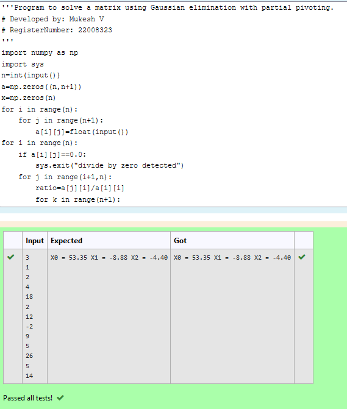

# Gaussian Elimination

## AIM:
To write a program to find the solution of a matrix using Gaussian Elimination.

## Equipments Required:
1. Hardware – PCs
2. Anaconda – Python 3.7 Installation / Moodle-Code Runner

## Algorithm
Step 1: Import the numpy module to use the built-in functions for calculation.

Step 2: Import the sys module to use the built-in functions.

Step 3: Get input from the user for number of rows and add it by 1 for number of columns.

Step 4: Using np.zeros() set the matrix as null matrix.

Step 5: Using nested for loop get input from the user for each element in the matrix.

Step 6: Using nested for loop find the ratio and perform the elementary row operations and find the final matrix.

Step 7: Use back substitution method to find the value of the variables and print it.

Step 8: End the program.

## Program:
```
/* Program to solve a matrix using Gaussian elimination with partial pivoting.
# Developed by: Mukesh V
# RegisterNumber: 22008323
*/
import numpy as np
import sys
n=int(input())
a=np.zeros((n,n+1))
x=np.zeros(n)
for i in range(n):
    for j in range(n+1):
        a[i][j]=float(input())
for i in range(n):
    if a[i][j]==0.0:
        sys.exit("divide by zero detected")
    for j in range(i+1,n):
        ratio=a[j][i]/a[i][i]
        for k in range(n+1):
            a[j][k]=a[j][k]-ratio*a[i][k]

x[n-1]=a[n-1][n]/a[n-1][n-1]
for i in range(n-2,-1,-1):
    x[i]=a[i][n]
    for j in range(i+1,n):
        x[i]=x[i]-a[i][j]*x[j]
    x[i]=x[i]/a[i][i]
for i in range(n):
    print("X%d = %0.2f"%(i,x[i]),end=" ")

```

## Output:



## Result:
Thus the program to find the solution of a matrix using Gaussian Elimination is written and verified using python programming.

